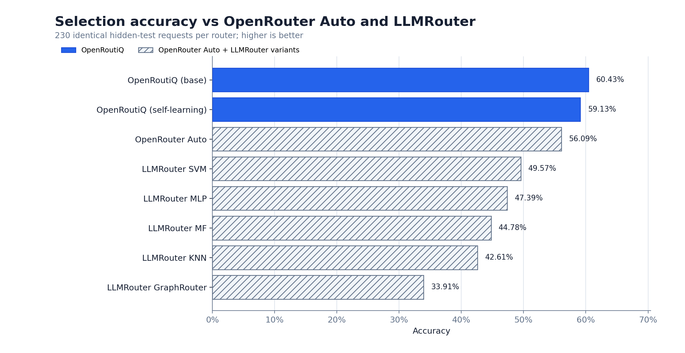
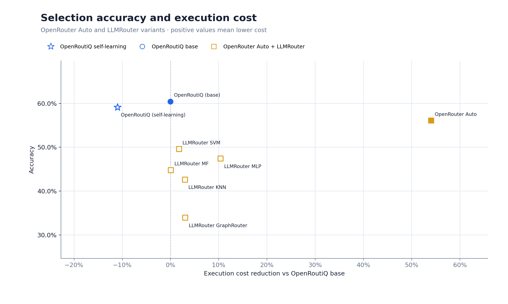
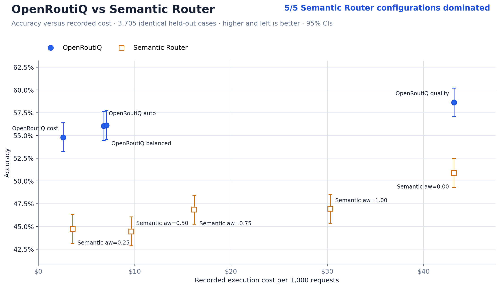
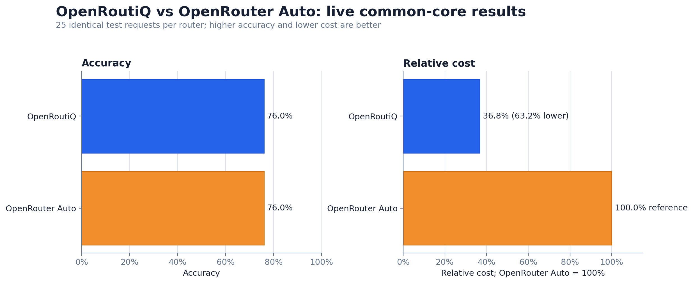
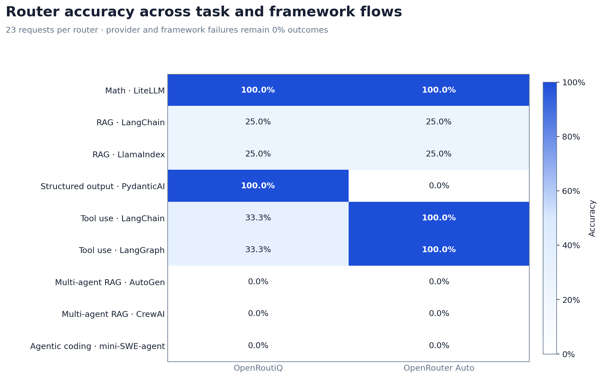
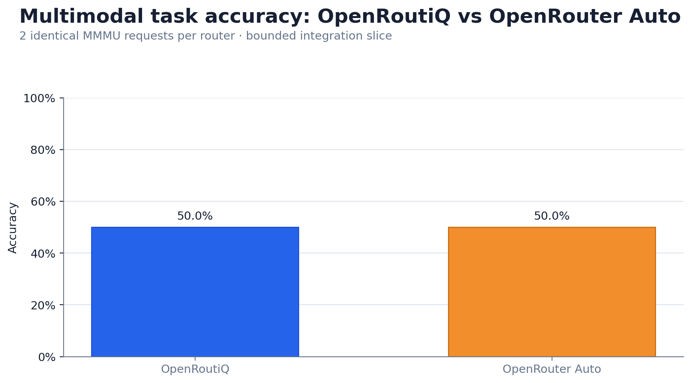
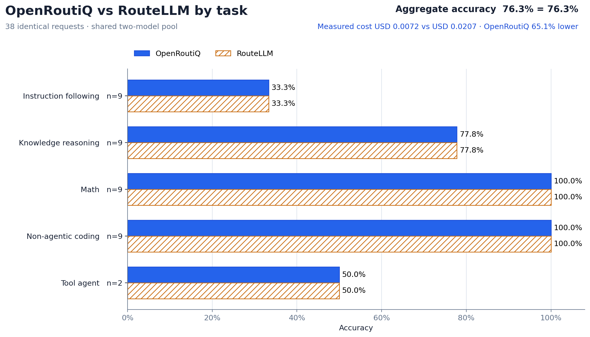
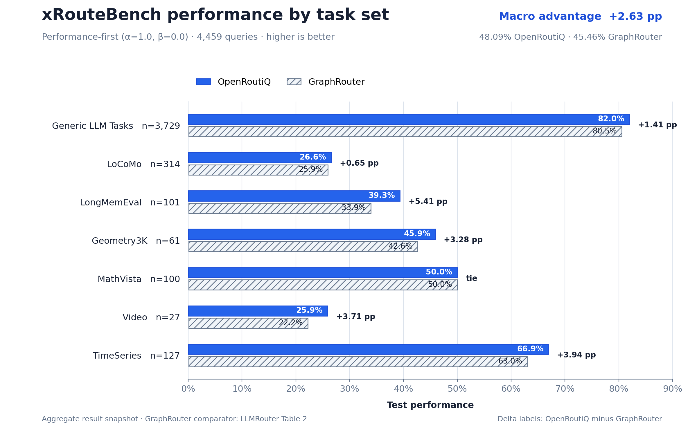

# OpenRoutiQ

## Stop hardcoding models. Route every request to the one that should win.

**OpenRoutiQ is an explainable, self-learning router for AI models.** It chooses the model,
provider, deployment, and reasoning level for each request, then adapts from the quality, cost,
latency, failures, and drift you actually observe.

> **Measured against the routers people use.** On our declared selection evaluation,
> OpenRoutiQ base reached **60.43% accuracy**, ahead of OpenRouter Auto at **56.09%** and every
> tested LLMRouter variant at **33.91%-49.57%**. Across the other declared evaluations, it
> dominated all five measured Semantic Router configurations, matched RouteLLM's best accuracy
> at **65.1% lower measured cost**, and exceeded xRouteBench's best published macro by
> **2.63 percentage points**. [See the methods, scope, and plots.](#benchmark-results)

**Route. Evaluate. Learn. Promote.** Start from catalog examples, record only outcomes you trust,
and let each model, provider, and reasoning-level variant build its own evidence. Automatic
promotion stays off until you validate it; policies, constraints, and explicit pins remain under
your control.

The routing core has zero dependencies, makes zero provider calls, and needs no API key. Add
provider clients or the OpenAI-compatible proxy only when you want OpenRoutiQ to execute the
selected route. Privacy-bounded OTLP, LangSmith, and Langtrace export is optional and off by
default.

## Quick start

Install the router and provider clients:

```bash
pip install "openroutiq[providers]"
```

Create a starter catalog for the provider you use:

```bash
openroutiq init --provider openrouter
```

Open `models.json` once and replace the placeholders with real model measurements. Extend `task_examples` with labeled requests from your workload; those examples train the local router. OpenRoutiQ deliberately does not present starter values as real benchmarks or a production training set.

The routing core alone has no dependencies:

```bash
pip install openroutiq
```

For a drop-in OpenAI-compatible endpoint:

```bash
pip install "openroutiq[proxy]"
openroutiq serve --catalog models.json
```

The router needs a model catalog, not a `.env` file. The `openroutiq init` command above writes
`models.json`, which lists the candidate models, capabilities, measurements, and task examples
used for routing. OpenRoutiQ does not require or automatically load `.env`. Provider credentials
are needed only when a provider client or the optional proxy executes the selected route; supply
them through the process environment or your existing secret manager.

## Python

```python
from openroutiq import route

decision = route(
    [
        {"role": "system", "content": "You are reviewing production Python."},
        {"role": "user", "content": "Find and fix this race condition."},
    ]
)

print(decision.selected.model_id)
print(decision.analysis.to_dict())
print(decision.selected.to_dict())
print(decision.review_required)
```

`route(...)` automatically reads and caches `models.json`. Pass `catalog="path/to/models.json"` or set `OPENROUTIQ_CATALOG` when it lives elsewhere.

For a long-running service that records outcomes or needs a custom analyzer, keep the explicit router object:

```python
from openroutiq import Router

router = Router.from_file("models.json")
```

Route an agentic request and prepare it for the selected provider without changing the original history or tools:

```python
messages = [{"role": "user", "content": "Look up the order and return JSON."}]
tools = [{
    "type": "function",
    "function": {
        "name": "lookup_order",
        "description": "Find an order by ID",
        "parameters": {"type": "object", "properties": {"id": {"type": "string"}}, "required": ["id"]},
    },
}]
schema = {
    "type": "json_schema",
    "json_schema": {"name": "order", "strict": True, "schema": {"type": "object"}},
}

decision = router.route(
    messages,
    tools=tools,
    tool_choice="required",
    parallel_tool_calls=True,
    response_format=schema,
    reasoning_effort="high",
    constraints={"allowed_providers": ["openai", "openrouter", "requesty"]},
)
plan = decision.prepare(
    messages,
    tools=tools,
    tool_choice="required",
    parallel_tool_calls=True,
    response_format=schema,
    agent_id="order-agent",
    run_id="run-123",
)
```

`plan.kwargs` matches the selected provider. `plan.invoke(client)` and `await plan.ainvoke(async_client)` call the correct SDK method. API keys stay in the provider client or environment.

Automatic routing adjusts the quality/latency/cost balance using inferred complexity. Explicit weights always override automatic weighting:

```python
decision = router.route(
    "Draft a short product announcement",
    weights={"quality": 50, "latency": 35, "cost": 15},
)
```

The catalog format is shown in [models.example.json](models.example.json). Its values are illustrative, not claims about real models.

## Developer controls

Choose a strategy:

```python
router.route(prompt, strategy="auto")      # context-adaptive weights
router.route(prompt, strategy="balanced")  # configured weights unchanged
router.route(prompt, strategy="quality")
router.route(prompt, strategy="speed")
router.route(prompt, strategy="cost")
router.route(prompt, strategy="risk_aware")  # expected utility blended with CVaR
```

Override inferred behavior or enforce hard limits:

```python
decision = router.route(
    messages,
    task="coding",
    complexity=90,
    strategy="quality",
    high_risk=True,
    constraints={
        "required_capabilities": ["tools", "json"],
        "allowed_providers": ["openai", "anthropic"],
        "blocked_providers": [],
        "candidate_ids": ["openai/fast", "anthropic/deep:high"],
        "reasoning_levels": ["high"],
        "min_context_tokens": 100_000,
        "min_quality": 85,
        "max_latency_ms": 5000,
        "max_predicted_cost": 0.10,
        "local_only": False,
    },
    soft_budget=0.05,
    tools=tools,
    tool_choice="required",
    parallel_tool_calls=True,
    response_format=schema,
    stream=True,
    reasoning_effort="high",
    pinned_model=None,
)
```

Hard constraints remove candidates before scoring. A soft budget, low task confidence, low score margin, low catalog confidence, or high-risk request flags the decision for human review while still returning the recommendation.

For probabilistic constraints, retain evaluated outcomes and supply a `RiskPolicy`:

```python
from openroutiq import ChanceConstraint, RiskPolicy

policy = RiskPolicy(
    constraints=(
        ChanceConstraint("success", minimum_probability=0.95),
        ChanceConstraint(
            "latency_at_most",
            threshold=4_000,
            minimum_probability=0.99,
        ),
        ChanceConstraint(
            "cost_at_most",
            threshold=0.02,
            minimum_probability=0.99,
        ),
    ),
    risk_aversion=0.6,
    cvar_alpha=0.95,
    minimum_samples=20,
    require_observed_probabilities=True,
)
decision = router.route(messages, strategy="risk_aware", risk_policy=policy)
```

Each ranked candidate then includes an `OutcomeForecast` with quality uncertainty,
success probability, latency/cost quantiles, event probabilities, joint empirical SLA
probability, and CVaR loss. Production policies require workload-calibrated telemetry and enough
evaluated samples for every probability used as a hard constraint.

For multi-call agent workflows, `input_tokens` and `expected_output_tokens` may be
cumulative billing estimates rather than one prompt. Pass the peak single-call window
separately with `required_context_tokens`; cost scoring still uses the cumulative token
totals:

```python
decision = router.route(
    request,
    input_tokens=180_000,
    expected_output_tokens=20_000,
    required_context_tokens=48_000,
)
```

## CLI

Create the default catalog, then edit its placeholders:

```bash
openroutiq init --provider openrouter
```

Automatic context-aware route:

```bash
openroutiq route "Fix this Python race condition"
```

Developer-controlled route:

```bash
openroutiq route "Fix this Python race condition" \
  --catalog models.providers.example.json \
  --strategy quality \
  --task coding \
  --allow-provider openrouter \
  --complexity 90 \
  --min-quality 75 \
  --max-latency 5000 \
  --reasoning-effort high \
  --requires-tools \
  --parallel-tools \
  --structured-output \
  --stream \
  --risk high
```

Use `--pin-model MODEL_ID` while returning tool results during an unfinished provider turn. Remove the pin for the next independent turn so OpenRoutiQ can choose again.

The command prints JSON so any language or framework can consume the decision.

## LangChain

LangChain v1 supports dynamic model selection through model-call middleware. Keep framework model objects in a map keyed by the same IDs used in the OpenRoutiQ catalog:

```python
from langchain.agents import create_agent
from langchain.agents.middleware import wrap_model_call
from langchain.chat_models import init_chat_model
from openroutiq import route

tools = [...]  # your LangChain tools
models = {
    "openai/fast": init_chat_model("openai:YOUR_FAST_MODEL"),
    "anthropic/deep:high": init_chat_model("anthropic:YOUR_DEEP_MODEL"),
}

@wrap_model_call
def smart_model(request, handler):
    decision = route(request.messages, tools=request.tools)
    return handler(request.override(model=models[decision.selected.model_id]))

agent = create_agent(
    model=models["openai/fast"],
    tools=tools,
    middleware=[smart_model],  # add OpenRoutiQ here
)
```

See LangChain's official [dynamic model middleware](https://docs.langchain.com/oss/python/langchain/agents#dynamic-model) documentation for provider-specific model setup.

For a complete runnable registry-and-dispatch pattern, see
[examples/frameworks/langchain_runnable.py](examples/frameworks/langchain_runnable.py).

## LangGraph

Use OpenRoutiQ inside the model node. It accepts LangChain message objects directly, so the graph keeps its complete conversation context:

```python
from langgraph.graph import END, START, MessagesState, StateGraph
from langchain.chat_models import init_chat_model
from openroutiq import route

tools = [...]  # your LangChain tools
models = {
    "openai/fast": init_chat_model("openai:YOUR_FAST_MODEL").bind_tools(tools),
    "anthropic/deep:high": init_chat_model("anthropic:YOUR_DEEP_MODEL").bind_tools(tools),
}

def call_model(state: MessagesState):
    decision = route(state["messages"], tools=tools)
    response = models[decision.selected.model_id].invoke(state["messages"])
    return {"messages": [response]}

graph = StateGraph(MessagesState)
graph.add_node("model", call_model)
graph.add_edge(START, "model")
graph.add_edge("model", END)
app = graph.compile()
```

The full [LangGraph workflow example](examples/frameworks/langgraph_workflow.py) adds an explicit
human-review branch and refuses to dispatch a selected variant without a trusted handler.

## Providers

The catalog controls the transport with `api_style`. See [models.providers.example.json](models.providers.example.json) for OpenAI Responses, Anthropic Messages, OpenRouter, Requesty, OpenAI-compatible, and LiteLLM templates. The numbers and model names are placeholders; verify every exact deployment before using them.

Populate each profile's `supported_parameters` from the exact provider/model contract. The
capability gate uses it to reject unsupported tools, tool choice, parallel calls, structured
outputs, and reasoning controls before dispatch. An omitted list preserves compatibility with
older catalogs but cannot provide parameter-level protection.

LiteLLM is the simplest universal execution layer. Store LiteLLM model strings in each profile's `model` field and set `api_style` to `litellm`:

```python
from litellm import completion
from openroutiq import Router

messages = [{"role": "user", "content": "Summarize this report"}]
decision = Router.from_file("models.json").route(messages)
plan = decision.prepare(messages, agent_id="summarizer", run_id="run-42")
response = plan.invoke(completion)
```

LiteLLM already supplies provider adapters, streaming, retries, failover, and deployment load balancing. OpenRoutiQ does not duplicate those features.

OpenAI, OpenRouter, and Requesty can all use the OpenAI client. `plan.invoke()` chooses Responses or Chat Completions from the selected profile:

```python
import os
from openai import OpenAI

decision = router.route(
    messages,
    constraints={"allowed_providers": ["openai", "openrouter", "requesty"]},
)
plan = decision.prepare(messages, agent_id="worker", run_id="run-42")
api_key = os.environ[f"{plan.provider.upper()}_API_KEY"]
client = OpenAI(api_key=api_key, **({"base_url": plan.base_url} if plan.base_url else {}))
response = plan.invoke(client)
```

OpenRouter profiles may set `provider_options` such as `sort`, `order`, `allow_fallbacks`, or data-retention controls. OpenRoutiQ adds `require_parameters: true` when tools, reasoning, or structured output must be supported. See OpenRouter's [provider routing](https://openrouter.ai/docs/guides/routing/provider-selection) and [tool calling](https://openrouter.ai/docs/guides/features/tool-calling) documentation.

Requesty profiles use `https://router.requesty.ai/v1` by default. Agent/run metadata is mapped into its `requesty` object. See Requesty's [quickstart](https://docs.requesty.ai/quickstart) and [reasoning mapping](https://docs.requesty.ai/features/reasoning).

Requesty's Anthropic-compatible path works too: set the profile's `api_style` to `anthropic_messages`, its `base_url` to `https://router.requesty.ai`, and use that URL when constructing the Anthropic client. Requesty documents the same base URL for its [Claude Agent SDK integration](https://docs.requesty.ai/integrations/anthropic-agent-sdks).

For the native Anthropic SDK, use Anthropic-format messages and tools:

```python
from anthropic import Anthropic

decision = router.route(
    anthropic_messages,
    tools=anthropic_tools,
    constraints={"allowed_providers": ["anthropic"]},
    reasoning_effort="high",
)
plan = decision.prepare(
    anthropic_messages,
    tools=anthropic_tools,
    parallel_tool_calls=False,
)
response = plan.invoke(Anthropic())
```

OpenRoutiQ maps Anthropic effort, adaptive/manual thinking, parallel-tool control, and `output_config.format`. It preserves thinking, redacted-thinking, tool-use, and tool-result blocks exactly as supplied. See Anthropic's [effort](https://platform.claude.com/docs/en/build-with-claude/effort), [tool use](https://platform.claude.com/docs/en/agents-and-tools/tool-use/how-tool-use-works), and [structured outputs](https://platform.claude.com/docs/en/build-with-claude/structured-outputs) documentation.

Frameworks and gateways can translate tool schemas between providers. When calling native SDKs directly, keep histories and tools in that provider's dialect. Do not change providers in the middle of a tool/reasoning turn; pass `pinned_model=previous_decision.selected.model_id` until the turn completes.

## Multi-agent systems

One `Router` can be shared by concurrent agents. Route each agent's complete local history, and carry IDs only as metadata:

```python
def plan_agent_call(agent_id, run_id, messages, tools, active_turn_model=None):
    decision = router.route(
        messages,
        tools=tools,
        pinned_model=active_turn_model,
    )
    plan = decision.prepare(
        messages,
        tools=tools,
        agent_id=agent_id,
        run_id=run_id,
        metadata={"team": "research"},
    )
    return decision, plan
```

Use a separate `run_id` per agent execution and `parent_run_id` for handoffs. Pin only while a tool/reasoning turn is unfinished; different agents do not need the same model.

## Any Python framework

```python
from openroutiq import route

decision = route(conversation_messages)
framework_model = model_registry[decision.selected.model_id]
result = framework_model.invoke(conversation_messages)
```

For non-Python frameworks, use the JSON CLI or the optional proxy; proxy integration is a single OpenAI base-URL change with `model="auto"`.

## Runnable examples

The examples are importable modules with shared lifecycle and privacy configuration. After
installing OpenRoutiQ, run them from the repository root with `python -m`:

```bash
python -m examples.quickstart.basic_routing
python -m examples.domains.customer_support
python -m examples.domains.financial_document_review
python -m examples.domains.healthcare_document_assist
```

| Area | Example | What it demonstrates |
| --- | --- | --- |
| Quick start | [basic routing](examples/quickstart/basic_routing.py) | Local selection with no provider call |
| Adaptive | [private model onboarding](examples/adaptive/private_model_onboarding.py) | Provisional registration, explicit pinning, and verified outcome learning |
| Customer support | [tool routing](examples/domains/customer_support.py) | Provider allowlist, tool contract, latency target, and cost ceiling |
| Finance | [document review](examples/domains/financial_document_review.py) | Strict structured output, risk-aware routing, and analyst approval |
| Healthcare | [document assistance](examples/domains/healthcare_document_assist.py) | High-risk routing with mandatory clinician review and no autonomous care decision |
| LangChain | [runnable registry](examples/frameworks/langchain_runnable.py) | Dispatch only to an allowlisted model runnable |
| LangGraph | [review-gated workflow](examples/frameworks/langgraph_workflow.py) | Routing node, trusted handlers, and a human-review branch |
| Observability | [exporter fan-out](examples/observability/exporter_fanout.py) | Generic OTLP, LangSmith, and Langtrace from one filtered event stream |

The LangChain example needs `langchain-core`; the LangGraph example needs `langgraph`. Their demo
handlers are offline and make no provider calls. Replace them with provider objects owned by your
application.

## OpenAI-compatible proxy

Existing agents and applications can keep their OpenAI-compatible client and change only the base URL plus `model="auto"`:

```python
from openai import OpenAI

client = OpenAI(base_url="http://127.0.0.1:8080/v1", api_key="unused-locally")
response = client.chat.completions.create(
    model="auto",
    messages=[{"role": "user", "content": "Fix this concurrency bug"}],
)
```

Use the Python SDK directly when the application wants selection without proxying execution. Use
the proxy when a framework already speaks the OpenAI protocol. Public proxy deployments must add
authentication, TLS, rate limits, request limits, tenant isolation, and controlled egress.

## Custom tasks, capabilities, and providers

The built-in task names and API styles are starter conventions, not a closed universe. Catalogs may define workload-specific task labels such as `legal_review`, `customer_support`, or `code_execution`. Capability strings are also extensible; built-in analysis recognizes vision, audio, video, documents, tools, structured output, streaming, and requested output modalities.

For a transport not built into OpenRoutiQ, give the profile a namespaced `api_style` and pass a
custom adapter to `decision.prepare(...)`. The adapter returns `ProviderRequest`, optionally with
its own sync/async invoker; provider execution remains outside the routing decision.

### Calibrated request-by-model selection

`CapabilityGate` filters incompatible models before any score is considered. The optional
`SelectionIntelligence` layer then predicts evaluated success, quality, cost, and latency for
each eligible request/model pair. `SelfLearningRouter` updates those local predictors from
explicit evaluator outcomes; it never treats a completed provider request as correctness.
Persisted selection state contains hashed numeric features and aggregates rather than prompts or
outputs. Calibrate and promote selection policies against held-out workload evidence, retain a
champion rollback, and keep state isolated wherever tenant telemetry cannot be shared.

### Private and future models: learn on encounter

OpenRoutiQ does not need a global list of every model. `AdaptiveRouter` starts with any trusted models the customer already uses, then learns public, private, fine-tuned, on-premise, or future model variants when the application encounters them:

For production, the customer must:

1. Give every deployment and reasoning level a stable, unique model ID.
2. Register its execution contract: provider/model handle, adapter style, endpoint, capabilities, context limit, initial latency, and input/output prices. No weights or source code are needed.
3. Keep provider credentials outside the contract in environment variables or the framework's secret store.
4. Explicitly pin the provisional model for initial evaluations, or enable budgeted exploration for safe traffic. Automatic promotion is off by default.
5. Send OpenRoutiQ a trustworthy end-to-end `quality_score` after execution. A successful HTTP response is not evidence of correctness.
6. Keep tenant registries separate unless cross-tenant learning is explicitly authorized.

The customer must adapt three things to its own system: the model contract, the executor that
maps the selected stable ID to a real client, and the evaluator that turns the complete flow into
a 0-100 task score. OpenRoutiQ deliberately cannot invent any of these for a closed model.
For example:

```python
decision = router.route(messages, task="legal_review")
response = model_clients[decision.selected.model_id].invoke(messages)
quality = evaluate_legal_review(response)  # deterministic, human, or business outcome
router.record_evaluation(
    messages,
    decision.selected.model_id,
    task=decision.task,
    quality_score=quality,
)
```

Use workload-specific task labels and evaluators: unit/integration tests for coding, tool and
side-effect assertions for agents, answer-plus-citation checks for RAG, schema/business-rule
checks for extraction, and reviewed or business outcomes where correctness is not deterministic.

```python
from openroutiq import AdaptiveRouter

router = AdaptiveRouter.from_file(
    "models.json",
    registry=".openroutiq/models.sqlite3",  # customer-local evidence
)

# Register the execution contract once. No weights, prompts, or provider secret are stored.
router.encounter_opaque(
    model_id="acme/legal-v7:high",
    provider="acme-private",
    model="legal-v7",
    api_style="openai_compatible",
    base_url="https://models.internal/v1",
    reasoning_level="high",
    max_context_tokens=64_000,
    capabilities=["text", "tools", "json_schema"],
    tasks=["legal_review"],
    latency_ms=800,
    input_price_per_million=0.40,
    output_price_per_million=0.80,
    local=True,
)

# Provisional models are usable immediately through an explicit override.
decision = router.route(request, pinned_model="acme/legal-v7:high")

# Supply an application or deterministic-evaluator outcome after execution.
router.record_evaluation(
    request,
    decision.selected.model_id,
    task="legal_review",
    quality_score=94,
    latency_ms=730,
    actual_cost_usd=0.003,
    success=True,
)
```

Each `model × provider/deployment × reasoning level` is learned independently. New variants begin `provisional`; explicit pins always work, while normal automatic routing uses only task-trusted variants. Evidence updates quality, latency, cost, failures, and drift immediately, but **automatic promotion is disabled by default**. An operator can promote a task after held-out review, or opt into task-specific automatic promotion only after validating the thresholds on representative traffic. Repeated execution failures or a recent quality drop mark only the affected task as `degraded`. Quality evidence decays with a 30-day half-life by default, and evidence-promoted trust becomes provisional when its latest evaluated quality is more than 90 days old. Models can be marked `dormant` or `quarantined` without deleting their history.

If your own paired, held-out calibration supports automation, enable it explicitly and choose
thresholds from representative workload evidence:

```python
from openroutiq import AdaptivePolicy, AdaptiveRouter

policy = AdaptivePolicy(
    automatic_promotion=True,
    promotion_samples=your_validated_sample_count,
    promotion_quality_floor=your_validated_quality_floor,
    promotion_success_rate=your_validated_success_floor,
)
router = AdaptiveRouter.from_file(
    "models.json",
    registry=".openroutiq/models.sqlite3",
    policy=policy,
)
```

Optional exploration is off by default. When enabled through `AdaptivePolicy`, it has a persistent daily dollar ceiling, a per-request ceiling, and is disabled for high-risk requests. The OpenAI-compatible proxy records latency, reported usage cost, token counts, and execution failures automatically; correctness still comes only from `record_evaluation(...)`, never self-grading.

The adaptive SQLite registry is explicit opt-in storage created only when `AdaptiveRouter` or
`--adaptive-registry` is used. The regular `Router`, `route(...)`, and proxy command create no
adaptive database. The registry stores model contracts, task labels, numeric outcomes, latency,
cost, and lifecycle state. It rejects credential-like fields and never stores prompts, responses,
model weights, or provider keys. Contextual embeddings remain a separate opt-in outcome store
with the privacy considerations described below. Use the pluggable `AdaptiveRegistryBackend`
for a shared Postgres/Redis/telemetry implementation at higher scale.

## How context intelligence works

Routing is a local pipeline. It does not ask another LLM which model to use:

1. Build one routing context from the full request, `RouteContext`, tool schemas, output format, and execution flags.
2. Infer cold-start task probabilities, complexity, token usage, and required capabilities from catalog examples and request structure.
3. When contextual outcomes are configured, embed that context locally and retrieve the nearest evaluations for each candidate model.
4. Blend nearby observed quality and latency with catalog priors. Similar, well-sampled outcomes receive more weight; sparse outcomes remain close to the priors.
5. Reject models that violate capabilities, context size, provider rules, budget, quality, latency, reasoning, or pinning constraints.
6. Normalize latency and cost across the survivors, calculate the weighted score, and return the winner, full ranking, exclusions, and review reasons.

This gives OpenRoutiQ two useful operating modes: catalog-trained TF-IDF for cold start, and semantic outcome routing once evaluated traffic exists. The same route can therefore choose differently for a planner, an executor with tools, or a reviewer without hardcoded prompt keywords.

The built-in analyzer examines:

- The full message history, not only the last prompt.
- Text length and conversation depth.
- A learned task distribution rather than a single keyword match.
- Image content blocks and existing tool calls.
- Available tool definitions, parallel-tool needs, structured output, and streaming.
- OpenAI function-call items, Anthropic tool/thinking blocks, and Gemini-style function steps.
- Estimated input size and requested capabilities.

`task_examples` trains a dependency-free local TF-IDF classifier when the catalog loads. Routing makes no LLM or network call and contains no task keyword table. `ContextAnalysis.task_scores` exposes the learned mixture, and model quality is averaged across it. Add examples that represent your real traffic; without training examples, automatic task selection deliberately falls back to low-confidence `general` instead of pretending to understand the prompt.

### Learning from outcomes

Learning is supervised and explicit. OpenRoutiQ does not grade its own responses or treat a routed selection as a successful outcome. After execution, the application supplies an end-to-end quality score and optional latency through `record_evaluation(...)`.

For production routing, use a local sentence encoder plus persisted cross-model evaluations. The helper accepts only an existing local model directory and sets the encoder to local-files-only mode:

```bash
pip install "openroutiq[embeddings]"
```

```python
from openroutiq import RouteContext, Router, local_sentence_embedder

embed = local_sentence_embedder(r"C:\models\sentence-encoder")
router = Router.from_file(
    "models.json",
    embedder=embed,
    outcome_store="openroutiq-outcomes.sqlite3",
    embedding_id="sentence-encoder-v1",
    outcome_similarity_threshold=0.55,
    out_of_domain_model="catalog-id-of-safe-default",
)

context = RouteContext(
    messages,
    agent_role="reviewer",
    workflow_step="verify",
    side_effect_level="read",
    budget_remaining=0.10,
    latency_deadline_ms=4_000,
    pinned_model=active_turn_model,
)
decision = router.route(context, tools=tools, response_format=schema)

# Record an end-to-end score after execution; include the same tool/output flags used for routing.
router.record_evaluation(
    context,
    decision.selected.model_id,
    quality_score=96,
    latency_ms=1_420,
    tools=tools,
    response_format=schema,
)
```

Each evaluation stores the context embedding, evaluated model, quality score, optional latency, and non-prompt metadata. On later requests, the router retrieves up to `outcome_neighbors` similar evaluations per model and computes similarity-weighted quality and latency estimates. The estimate is blended with the catalog prior using both similarity and sample count, so one observation cannot immediately dominate routing.

Low-similarity requests set `out_of_domain`, request review, and optionally use `out_of_domain_model`. Candidate explanations expose the catalog score, contextual score, similarity, sample count, and blend weight. To learn real model differences, evaluate more than one candidate through offline replay, canaries, or exploration; feedback from only the selected model leaves untried models on their catalog priors.

SQLite stores normalized embeddings, scores, latency, and non-prompt workflow metadata. It does not store raw request text, but embeddings can still carry sensitive information, so protect the database like telemetry. Change `embedding_id` whenever the encoder or embedding dimension changes.

Explicit `task`, `complexity`, `high_risk`, weights, strategy, reasoning effort, model pinning, and constraints override inferred behavior. Risk is explicit because silently guessing safety-critical domains from keywords is unreliable. Required tool, parallel-tool, JSON Schema, streaming, context, and provider capabilities are filtered before scoring.

When capabilities matter, OpenRoutiQ folds their reliability into the quality score. A coding model with weak tool-use results does not outrank a slightly weaker coder that is much more reliable at the tools required by the request.

For ambiguous context, an application may plug in a stronger local classifier as a callback. It runs only below the configured confidence threshold and falls back safely if it fails:

```python
from openroutiq import ContextAnalysis, Router

def analyze_with_your_classifier(request, initial: ContextAnalysis) -> ContextAnalysis:
    # Run your local classifier and return a validated ContextAnalysis.
    return your_context_classifier(request, initial)

router = Router.from_file(
    "models.json",
    context_analyzer=analyze_with_your_classifier,
    analysis_threshold=70,
)
```

The older task-level hooks remain useful for process-local cold-start corrections:

```python
router.record_outcome("anthropic/deep:high", "coding", quality_score=94)
router.record_latency("anthropic/deep:high", latency_ms=1850)
```

In-process telemetry updates are thread-safe; contextual evaluations persist in SQLite. The outcome lookup intentionally uses a linear scan until the evaluation table is large enough to justify a vector index.

## Score

```text
total = (
    quality_weight * effective_quality
  + latency_weight * latency_score
  + cost_weight * cost_score
) / total_weight
```

Quality starts with catalog/task priors, then blends nearby observed outcomes when a local embedder and store are configured. Required tool-use, vision, and extraction reliability still contribute. Latency and predicted request cost are normalized only across eligible candidates. Hard requirements are applied first.

Selection, provider-native request preparation, and execution remain separate component
boundaries; routing never invokes a model by itself.

## Benchmark results

The reusable benchmark API and `openroutiq-benchmark` CLI ship with OpenRoutiQ. Initialize a
synthetic, network-free workspace and exercise the complete workflow:

```powershell
openroutiq-benchmark init
openroutiq-benchmark validate .openroutiq/benchmark-example/replay.json
openroutiq-benchmark estimate .openroutiq/benchmark-example/replay.json
openroutiq-benchmark run .openroutiq/benchmark-example/replay.json --confirm-benchmark
```

`validate` checks the dataset and router contracts. `estimate` reports cases, live calls, and the
worst-case model cost before execution. Live adapters additionally require `--allow-live`, an
explicit call cap, and an explicit cost cap. The generated values are synthetic and must never be
reported as real model or router evidence.

Only aggregate snapshots and plots for the declared evaluations are published. Their private
datasets, prompts, model outputs, experiment-specific graders, configurations, and raw ledgers
are excluded from the repository and release archives. These measurements describe the declared
model pools and request sets; they are not universal performance claims.

> **Competitive benchmark summary.** Across our declared evaluations, OpenRoutiQ beat
> OpenRouter Auto and LLMRouter variants in selection accuracy, dominated all five measured
> Semantic Router configurations, matched RouteLLM's best accuracy at 65.1% lower measured cost,
> and exceeded xRouteBench's best published macro by 2.63 percentage points.

### Router selection benchmark

This paid evaluation compared eight named router systems on the same 230 test requests and
five-model candidate pool. Accuracy is the percentage of requests graded successful. Execution
cost is the provider-reported cost for those same requests, shown relative to OpenRoutiQ base.
Rows are sorted by accuracy, with cost reported separately instead of being hidden inside an
opaque combined score. The broader evaluation used 455 requests and 2,739 provider calls and
completed within its approved call and spend limits.

| Router | Accuracy | Execution cost vs OpenRoutiQ base |
|---|---:|---:|
| OpenRoutiQ base | **60.43%** | Reference |
| OpenRoutiQ self-learning | 59.13% | 11.0% higher |
| OpenRouter Auto | 56.09% | **54.0% lower** |
| LLMRouter SVM | 49.57% | 1.8% lower |
| LLMRouter MLP | 47.39% | 10.4% lower |
| LLMRouter MF | 44.78% | 0.1% lower |
| LLMRouter KNN | 42.61% | 3.0% lower |
| LLMRouter GraphRouter | 33.91% | 3.1% lower |

OpenRoutiQ base's **60.43%** selection accuracy leads OpenRouter Auto at **56.09%** and every
measured LLMRouter implementation: **SVM 49.57%**, **MLP 47.39%**, **MF 44.78%**, **KNN
42.61%**, and **GraphRouter 33.91%**. This is a scoped selection-accuracy comparison on the
shared 230-request test set; production learning updates remain validation-gated.

<table>
  <tr>
    <td width="50%"><strong>OpenRouter Auto and LLMRouter selection accuracy</strong><br></td>
    <td width="50%"><strong>Selection accuracy and cost</strong><br></td>
  </tr>
</table>

### Semantic Router recorded-outcome comparison

On 3,705 identical held-out LLMRouterBench cases, OpenRoutiQ quality reached **58.62%** accuracy
versus **50.88%** for the highest-accuracy measured Semantic Router BM25 configuration: a
**+7.75 percentage-point** advantage. At the low-cost end, OpenRoutiQ cost reached **54.79%** at
**$2.58 per 1,000 recorded requests**, while Semantic Router's cheapest measured configuration
reached **44.72%** at **$3.56 per 1,000**. All **five of five** measured Semantic Router
configurations are dominated by at least one OpenRoutiQ configuration. This means the OpenRoutiQ
configuration is at least as accurate and no more expensive, with at least one strict advantage.

This is a same-split recorded-outcome selection replay, not a claim about current live provider
availability or generation latency. Whiskers show 95% accuracy confidence intervals.



### Paid live routing snapshot

The live OpenRouter snapshot contains 23 tracks, 694 real case-system observations, and 886 settled
calls. On the 25-case common core, OpenRoutiQ balanced tied OpenRouter Auto medium at 76.0% while
costing 63.2% less. On a separate 38-request shared two-model comparison, OpenRoutiQ matched
RouteLLM's best measured accuracy at **76.3%** while costing **65.1% less**.

<table>
  <tr>
    <td width="50%"><strong>OpenRouter Auto comparison</strong><br></td>
    <td width="50%"><strong>Task and framework flows</strong><br></td>
  </tr>
  <tr>
    <td width="50%"><strong>Multimodal task comparison</strong><br></td>
    <td width="50%"><strong>RouteLLM accuracy and cost comparison</strong><br></td>
  </tr>
</table>

### xRouteBench: 48.09% versus the published 45.46% leader

On the [official xRouteBench](https://huggingface.co/datasets/ulab-ai/xRouteBench)
performance-first setting $(\alpha, \beta) = (1.0, 0.0)$, OpenRoutiQ reaches a
**48.09% unweighted seven-dataset macro**, compared with **45.46%** for GraphRouter:
**+2.63 percentage points** and **+5.78% relative**. The
[LLMRouter paper](https://arxiv.org/abs/2608.06867v1) identifies GraphRouter as its
highest-average Table 2 router, so this result exceeds every individual published
router's macro on that table. It does not mean OpenRoutiQ wins every dataset.

The comparison covers **4,459 test queries**, each with recorded outcomes for the
same **18-model candidate pool** (80,262 test query-model rows). Values below are
displayed to two decimals.



| Task set | Queries | OpenRoutiQ | GraphRouter | Delta |
|---|---:|---:|---:|---:|
| Generic LLM Tasks | 3,729 | **81.95%** | 80.54% | **+1.41 pp** |
| LoCoMo | 314 | **26.59%** | 25.94% | **+0.65 pp** |
| LongMemEval | 101 | **39.34%** | 33.93% | **+5.41 pp** |
| Geometry3K | 61 | **45.90%** | 42.62% | **+3.28 pp** |
| MathVista | 100 | 50.00% | 50.00% | 0.00 pp |
| Video | 27 | **25.93%** | 22.22% | **+3.71 pp** |
| TimeSeries | 127 | **66.93%** | 62.99% | **+3.94 pp** |
| **Unweighted macro** | **4,459** | **48.09%** | **45.46%** | **+2.63 pp** |

OpenRoutiQ records **six wins and one tie against GraphRouter** across the seven displayed task
sets.

This snapshot covers the seven displayed non-personalized datasets and the declared 18-model
pool. It does not establish universal superiority across unseen datasets, providers, model pools,
budgets, or live reliability conditions.

## Privacy-safe observability exports

Observability is opt-in. With no `Observability` object attached, OpenRoutiQ starts no telemetry
worker and makes no observability network calls. Install the OpenTelemetry SDK and OTLP
HTTP/protobuf exporter when you want generic OTLP or LangSmith export:

```bash
pip install "openroutiq[observability]"
```

### Generic OpenTelemetry / OTLP

Send spans to an OpenTelemetry Collector or any OTLP-compatible trace endpoint. The Collector can
forward them to backends such as Jaeger, Zipkin, or a vendor platform; OpenTelemetry recommends
the Collector for production. Inject the token and hash key through your process secret manager;
OpenRoutiQ does not load `.env` files. See the official
[OpenTelemetry Python exporter guide](https://opentelemetry.io/docs/languages/python/exporters/).

```python
import os

from openroutiq import Observability, ObservabilityPrivacy, OTLPExporter, Router

exporter = OTLPExporter(
    endpoint=os.environ["OTEL_EXPORTER_OTLP_TRACES_ENDPOINT"],
    protocol="http/protobuf",
    headers={
        "Authorization": f"Bearer {os.environ['OTEL_EXPORTER_OTLP_TOKEN']}",
    },
    service_name="checkout-router",
)
privacy = ObservabilityPrivacy(
    # Use a stable 16+ byte secret only when hashes must correlate across restarts.
    pseudonymization_key=os.environ["OPENROUTIQ_OBSERVABILITY_HASH_KEY"],
)

with Observability([exporter], privacy=privacy) as observability:
    router = Router.from_file("models.json", observability=observability)
    decision = router.route("Route this request", task="general")
    if not observability.flush(timeout_seconds=5):
        raise RuntimeError("telemetry flush timed out")
```

For OTLP/gRPC, install `openroutiq[observability-grpc]`, set `protocol="grpc"`, and pass the
collector's gRPC endpoint. If your service already owns an OpenTelemetry SDK pipeline, wrap its
tracer with `OpenTelemetryExporter(tracer)` instead of creating another provider. The
dependency-free `OTLPHTTPJSONExporter` is also available for endpoints that explicitly require
OTLP/HTTP JSON.

### LangSmith

`LangSmithExporter` uses LangSmith's documented OTLP trace endpoint and project header. It emits
only OpenRoutiQ's filtered spans; it does not enable LangChain or LangGraph auto-instrumentation.
See LangSmith's [OpenTelemetry tracing guide](https://docs.langchain.com/langsmith/trace-with-opentelemetry).

```python
import os

from openroutiq import LangSmithExporter, Observability, Router

exporter = LangSmithExporter(
    os.environ["LANGSMITH_API_KEY"],
    project_name="routing-production",
)

with Observability([exporter]) as observability:
    router = Router.from_file("models.json", observability=observability)
    decision = router.route("Route this request")
```

### Langtrace

Langtrace's endpoint expects OTLP/HTTP JSON, so its adapter needs no Langtrace SDK and does not
turn on prompt/completion instrumentation:

```python
import os

from openroutiq import LangtraceExporter, Observability, Router

exporter = LangtraceExporter(os.environ["LANGTRACE_API_KEY"])

with Observability([exporter]) as observability:
    router = Router.from_file("models.json", observability=observability)
    decision = router.route("Route this request")
```

Self-hosted endpoints can be supplied with `endpoint=`; follow Langtrace's
[OTLP configuration guide](https://docs.langtrace.ai/supported-integrations/otel-support/otel-configuration).

### Fan out safely

One bounded dispatcher can export the same filtered event to several destinations:

```python
observability = Observability(
    [
        OTLPExporter(endpoint=collector_endpoint),
        LangSmithExporter(langsmith_api_key, project_name="routing-production"),
        LangtraceExporter(langtrace_api_key),
    ],
    privacy=ObservabilityPrivacy(pseudonymization_key=stable_hash_key),
    max_queue_size=2048,
)
```

The complete environment-driven version is
[examples/observability/exporter_fanout.py](examples/observability/exporter_fanout.py).

### Privacy and routing guarantees

- Exported events use a fixed allowlist of routing, execution, and evaluation metrics. They never
  accept prompts, messages, completions, response bodies, tool arguments, exception messages,
  credentials, headers, arbitrary metadata, or caller request IDs.
- Model, provider, and task identifiers are keyed hashes by default. Raw identifiers require the
  explicit `ObservabilityPrivacy(include_*_identifiers=True)` flags. Without a configured hash
  key, pseudonyms are process-local and change after restart.
- Routing completes before an event is queued. Export runs on a dedicated daemon worker; a full
  bounded queue drops the event instead of delaying selection. Exporter errors cannot change a
  decision, learning result, provider response, or exception.
- `observability.stats` exposes only numeric accepted, dropped, rejected, and exporter-failure
  counts. Exporter exception text is not logged because transport errors can contain secrets.
- Remote plaintext HTTP endpoints are rejected by default. Use TLS; insecure HTTP requires an
  explicit opt-in and is intended for controlled local networks.
- Call `flush()` before short-lived processes exit and `shutdown()` during service termination.

These guarantees cover OpenRoutiQ's exporters. If you separately enable a framework's automatic
instrumentation, review that framework's settings: it may capture prompts, completions, tools, or
application state independently of OpenRoutiQ.

## Why routing complexity explodes in today's AI ecosystem

The size of a routing catalog is multiplicative:

$$
\text{Models} \times \text{Providers/Deployments} \times \text{Reasoning Levels}.
$$

Multiplication describes how many choices exist. A term such as $\log(n)$ belongs only in the
runtime analysis of a particular lookup or indexing algorithm; it does not describe the size of
the routing space.

Let $\mathcal T$ be the task families, $\mathcal M$ the models, $\mathcal P_m$ the providers
serving model $m$, $\mathcal D_{m,p}$ the deployments of $m$ on provider $p$, and
$\mathcal R_{m,p,d}$ the reasoning levels supported by deployment $d$. The set of all routable
variants is $\mathcal V$, and one variant is

$$
v=(m,p,d,r).
$$

The exact catalog cardinality is

$$
|\mathcal V| = \sum_{m\in\mathcal M} \sum_{p\in\mathcal P_m}
\sum_{d\in\mathcal D_{m,p}} |\mathcal R_{m,p,d}|.
$$

A simpler, deliberately loose upper bound is

$$
|\mathcal V| \le |\mathcal M| \times |\mathcal P| \times |\mathcal D|
\times |\mathcal R|.
$$

The summation is more accurate because not every model is available through every provider,
deployment, or reasoning level. In a catalog that distinguishes only model and reasoning level,
this reduces to

$$
|\mathcal V| = \sum_{m\in\mathcal M}|\mathcal R_m|
\le |\mathcal M|\times|\mathcal R|.
$$

For $T=|\mathcal T|$ task families and $V=|\mathcal V|$ variants, a static task-versus-variant
score matrix has $T\times V$ entries, while the number of possible deterministic mappings from
task families to variants is $V^T$:

$$
\boxed{\text{Static matrix size}=T\times V \qquad
\text{Possible static routing policies}=V^T}.
$$

OpenRoutiQ goes beyond a task-type lookup: it uses the whole request $x$. For policy $\pi$, it
first constructs the eligible set

$$
\mathcal V_{\pi}(x) = \left\{v\in\mathcal V \;\middle|\;
\operatorname{capable}(v,x) \land \operatorname{approved}(v) \land
\operatorname{allowed}_{\pi}(v,x)\right\},
$$

then chooses the eligible variant with the highest predicted policy-adjusted utility:

$$
\boxed{v^*(x) = \underset{v\in\mathcal V_{\pi}(x)}{\arg\max}\;
\widehat U(x,v)}.
$$

One useful decomposition is

$$
\widehat U(x,v) = w_q\widehat Q(x,v) - w_c\widehat C(x,v)
- w_l\widehat L(x,v) - w_r\widehat R(x,v),
$$

where $\widehat Q$ predicts quality or success, $\widehat C$ cost, $\widehat L$ latency, and
$\widehat R$ failure, uncertainty, or drift risk. The operator-controlled weights
$w_q,w_c,w_l,w_r$ express the active policy. This is the core OpenRoutiQ loop: filter
incompatible or unapproved variants, predict their outcomes, and choose the best eligible
expected utility for the request.

## Contributing

See [CONTRIBUTING.md](CONTRIBUTING.md) for development, review, and private security-report
instructions. Never include provider keys, private prompts, or unlicensed benchmark data in an
issue or pull request.

## License

OpenRoutiQ is released under the [MIT License](LICENSE).

## Test

PowerShell:

```powershell
$env:PYTHONPATH="src"
python -m unittest discover -s tests -v
python -m ruff check .
python -m ruff format --check .
python -m mypy
python scripts/check_release.py
```

macOS/Linux:

```bash
PYTHONPATH=src python -m unittest discover -s tests -v
python -m ruff check .
python -m ruff format --check .
python -m mypy
python scripts/check_release.py
```
